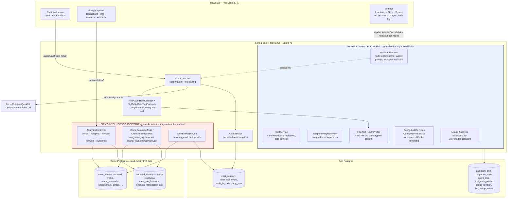

# Architecture diagram (PPT slide 7)

The backend is a **generic, multi-tenant AI agent platform** (`assistant/`, `skill/`, `style/`,
`tool/` incl. `tool/auth`, `mcp/`, `document/`, `audit/config/`, `chat/usage`) with the
**Crime-Intelligence Assistant** as one configured Assistant running on it (`crime/`,
`analytics/` are the only domain-specific packages). "Crime Intelligence" is a row in the
`Assistant` table, not a special case — the same platform could stand up a new Assistant for
another KSP division with no new backend engineering.

## Notes for the slide

- **Platform vs. application layer**: `Assistant/Skill/ResponseStyle/HttpTool+AuthProfile/
  ConfigAudit/UsageAnalytics` are generic services with no crime-domain knowledge — they'd exist
  identically if this were deployed for any other department. `CrimeDatabaseTools/AnalyticsController/
  AlertEvaluationJob` are the one Assistant's domain-specific tool/API layer, funneled through the
  exact same `RoleGate`/`Audit` spine as every other tool call.
- **Role-gating happens twice, independently**: once at the tool level
  (`RoleGatedToolCallback` — hides `offender_profile`/`detect_offender_groups`/
  `list_account_transactions`/`trace_money_network`/`suspicious_transactions` entirely from
  non-investigative roles) and once at the SQL level (`SqlTableGateToolCallback` — blocks
  `financial_transaction`/`financial_account`/`offender_risk_score` by name inside arbitrary
  `run_crime_sql` text, since tool-hiding alone means nothing against free-form SQL).
- **`accused_identity` is a derived layer, not a source table** — it computes cross-case offender
  identity from name/gender/age instead of assuming a person key exists in the source data (the
  official schema has none). Everything downstream (`offender_risk_score`, network, financial
  linkage) joins through it.
- **Two independent Postgres databases**, deliberately: app/platform data (assistants, skills,
  styles, tool auth profiles, config revisions, usage events, sessions, audit, alerts) is never
  mixed with the read-mostly crime FIR data, which loads/updates via its own idempotent
  schema-init pipeline (`ServiceConfig.crimeDataSourceInitializer`) separate from the app
  datasource's.
- **Secrets never sit inline**: `ToolAuthProfile` credentials for external HTTP integrations are
  AES-256-GCM encrypted at rest (`EncryptionService`, keyed by `AGENT_ENCRYPTION_KEY`), so an
  Assistant can call another government system's API without a hardcoded secret anywhere in
  config or source.
