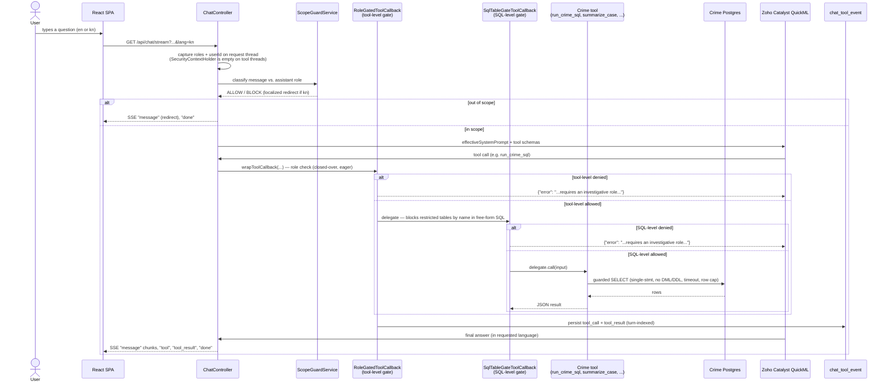
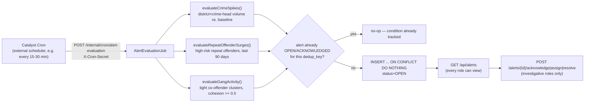
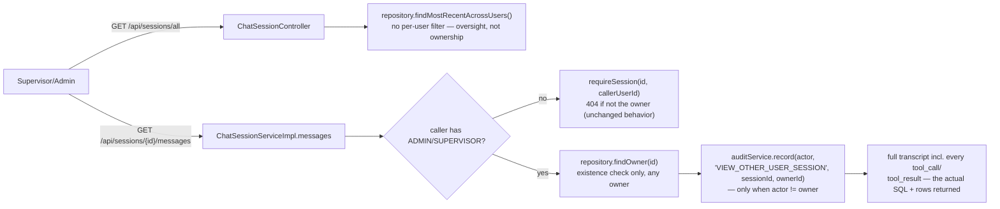
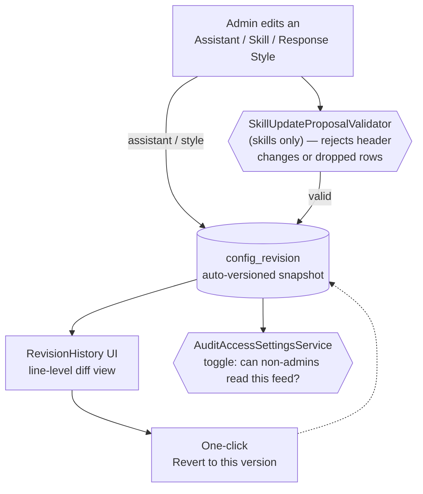

# Process flow / use-case diagrams (PPT slide 5)

## 1. A chat turn, end to end

## 2. Real early-warning alerts (Phase 4.12)

## 3. Supervisor accountability review (Phase 4.4)

## 4. Config governance — every configuration change is versioned

Applies uniformly across the generic agent platform, not just the crime domain: editing any
Assistant, Skill, or Response Style produces the same auditable trail.

- `ResourceType` covers `assistant, skill, tool, tool_group, tool_auth, document, response_style,
  mcp_server, mcp_tool`, but only `assistant`, `skill`, and `response_style` are fully versioned
  (snapshot + revert) — the rest get feed events only.
- Revert replays the stored snapshot back through the same update path the PUT/PATCH endpoint uses
  (skills are special-cased via `SkillService.revertToVersion` since their content lives in blob
  storage, not a DB row).
- `AuditAccessSettingsService` is an admin-toggleable setting controlling whether non-admin roles get
  read-only access to the feed/revisions; revert itself stays admin-only always.
